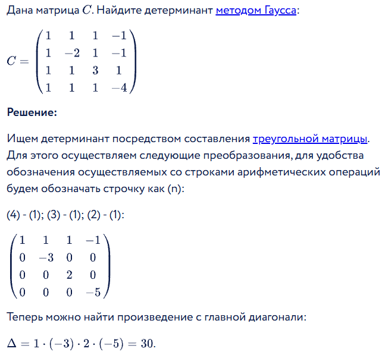

# Операции с матрицами!

## Теория:

### Умножение матриц 
1. Можно перемножить матрицы только в случае, есть они будут размера: m * n & n * k
2. Пример метода перемножения: 

### Определитель(*детерминант*)
1. До матрицы 4x4(не включительно) определитель находится с помощью сложения диагоналей в одну сторону и вычетанием сложения диагоналей в другую сторону 
2. Если же матрица больше, то стоит воспользоваться методом Гауса
3. Пример метода Гауса на матрице 4x4:  

## Мои операции:
1. [matrix_determinant](https://github.com/Fedor-777/alkury_projects/blob/main/matrices/matrix_determinant.py) - нахождение определителя только до матриц 3х3 включительно 
2. [matrix_multiplication](https://github.com/Fedor-777/alkury_projects/blob/main/matrices/matrix_multiplication.py) - умножение матриц верного формата из теории